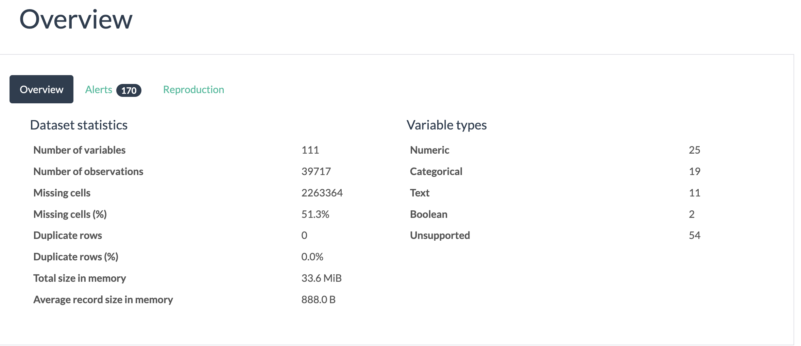

# Project Name
> Apply EDA to analyze a financial case study - Lending Club Case Study
 

## Table of Contents
- [Project Name](#project-name)
  - [Table of Contents](#table-of-contents)
  - [General Information](#general-information)
    - [Context](#context)
    - [Business Objectives](#business-objectives)
    - [Interpreted The Meaning of Dataset](#interpreted-the-meaning-of-dataset)
  - [Conclusions](#conclusions)
  - [Technologies Used](#technologies-used)
  - [Acknowledgements](#acknowledgements)
  - [Contact](#contact)

## General Information 

### Context

When a person applies for a loan, there are two types of decisions that could be taken by the company:

- Loan accepted: If the company approves the loan, there are 3 possible scenarios described below:

    -  Fully paid: Applicant has fully paid the loan (the principal and the interest rate)

    - Current: Applicant is in the process of paying the instalments, i.e. the tenure of the loan is not yet completed. These candidates are not labelled as 'defaulted'.

    - Charged-off: Applicant has not paid the instalments in due time for a long period of time, i.e. he/she has defaulted on the loan 

- Loan rejected: The company had rejected the loan (because the candidate does not meet their requirements etc.). Since the loan was rejected, there is no transactional history of those applicants with the company and so this data is not available with the company (and thus in this dataset)

### Business Objectives

The company wants to understand the driving factors (or driver variables) behind loan default, i.e. the variables which are strong indicators of default.  The company can utilise this knowledge for its portfolio and risk assessment. 

### Interpreted The Meaning of Dataset

- Dataset contains the complete loan data for all loans issued through the time period 2007 t0 2011 (given in module introduction).
- There are 39717 rows and 111 columns
- There are 54 columns with highest missing values 39717. I think we should remove these after looking into it carefully. Some of them might be ouput columns where we need to find the values.
- Also few columns are there with many missing values. Some columns contain 1k, 2.4k, 12.9k, 25k, 37k, 38k missing values in it.

## Conclusions
- Conclusion 1 from the analysis
- Conclusion 2 from the analysis
- Conclusion 3 from the analysis
- Conclusion 4 from the analysis

<!-- You don't have to answer all the questions - just the ones relevant to your project. -->

## Technologies Used
- ydata_profiling - version 23.2.1
- ipywidgets - version 8.1.1
- termcolor - version 2.3.0

<!-- As the libraries versions keep on changing, it is recommended to mention the version of library used in this project -->

## Acknowledgements
Give credit here.
- This project was inspired by...
- References if any...
- This project was based on [this tutorial](https://www.example.com).

## Contact
Created by [Dnyaneshwari Chidrawar](https://github.com/Dnyaneshwari-Chidrawar) and [Duc-Luong](https://github.com/irish-luong) - feel free to contact us!
